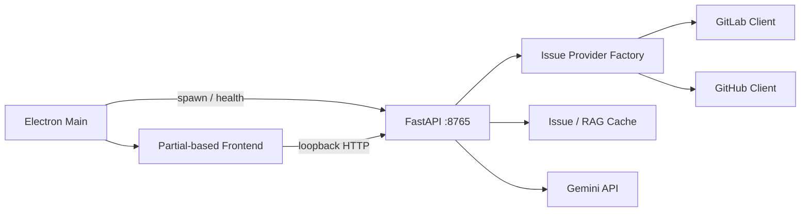

# Runtime Overview

## Process 結構

| 層級          | 主要檔案                                                             | 職責                                                     |
| ------------- | -------------------------------------------------------------------- | -------------------------------------------------------- |
| Electron Main | `src/main.ts`                                                        | 啟動/關閉 backend、建立視窗、IPC、外部連結、PDF          |
| Preload       | `src/preload.ts`                                                     | 透過 `contextBridge` 暴露受控 bridge                     |
| Frontend      | `frontend/index.html`、`partials/*`、`bootstrap.js`、`legacy-app.ts` | 組裝 UI、呼叫 API、管理非 secret 偏好                    |
| Backend       | `backend/app.py`、`backend/core/*`                                   | Provider 同步、cache、分析、RAG、AI、Arrange、報表、排程 |

## 啟動流程

1. Electron 啟動 Python `backend/app.py` 或 packaged backend executable。
2. Main process 輪詢 `GET /api/health`，後端固定 bind `127.0.0.1:8765`。
3. Electron 載入 `frontend/index.html`。
4. `bootstrap.js` 載入 partials，再掛載 `dist/frontend/scripts/legacy-app.js`。
5. Frontend 讀取 config、capabilities、dashboard 與 issues。

開發模式優先使用 `.venv\Scripts\python.exe`；封裝模式使用 `backend/dist/gitlab-tracker-backend/`。

## Backend 模組

| 模組                     | 職責                                                             |
| ------------------------ | ---------------------------------------------------------------- |
| `backend/app.py`         | FastAPI routes、AI 呼叫、analytics 與 HTML 報表組裝              |
| `core/provider.py`       | `IssueProvider` protocol、factory、active provider、capabilities |
| `core/gitlab_client.py`  | GitLab REST API 與 normalization                                 |
| `core/github_client.py`  | GitHub REST API、PR 排除、normalization、relations、rate limit   |
| `core/config_store.py`   | Config/meta/data paths、migration、secret masking                |
| `core/rag_service.py`    | RAG index、jobs、搜尋與來源隔離                                  |
| `core/report_service.py` | Dashboard、normalized view、週報                                 |
| `core/issue_arrange.py`  | URL/filter parsing、raw text、Excel、歷史                        |
| `core/scheduler.py`      | App 內 daily sync / weekly report 排程                           |

`app.py` 目前仍偏大，包含超出 routing/composition 的責任；後續應逐步移出 AI、analytics 與報表 route service。

## Provider 與同步資料流

1. UI 呼叫 `POST /api/fetch`。
2. Import JSON 若已設定則優先；否則 factory 建立 active provider。
3. Provider 取得 Issue list 並輸出 schema v2 normalized Issues。
4. 後端比較 `user_notes_count`，標記 `has_new_discussions`。
5. 寫入 `issues_cache.json` 與 `meta.json.last_sync`。
6. Dashboard、Analytics、Timeline、Table、RAG 與報表使用 cache。

GitHub bulk list 不抓完整 relations，`relation_counts_known=false`；Issue Detail 開啟後才載入 related PR、dependencies、parent 與 sub-issues。

## RAG 與 AI Chat

1. `POST /api/rag/reindex` 從目前 Issue cache 建立索引與背景 job。
2. `POST /api/rag/search` 依 query/filter 找出相關 chunks。
3. `POST /api/chat` 可使用 RAG sources 或簡化 Issue list，並依 model candidates fallback。
4. 切換來源時，RAG index/jobs 與 Issue cache 一併清除。

## Issue Arrange

1. UI 提交 GitLab/GitHub Issue URL 或 filter URL。
2. Provider 解析並取得 Issue 與 comments/discussions。
3. Backend 組合 raw text，可交給選定模型處理。
4. Scrape/result/Excel 寫入 `arrange_exports/`。

## 排程

`TrackerScheduler` 在 FastAPI lifespan 內每 30 秒檢查 daily sync 與 weekly report，並以 `meta.json.scheduler` 做同日去重。App 關閉時排程不會執行。

## 外部整合

| 整合                           | 用途                                                   |
| ------------------------------ | ------------------------------------------------------ |
| GitLab REST API v4             | Issues、discussions、MR、links                         |
| GitHub REST API                | Issues、comments、related PR、dependencies、sub-issues |
| Google Generative Language API | Summary、Chat、Arrange                                 |
| Electron Shell/Dialog          | 開檔、外部網址、JSON 選擇、PDF                         |
