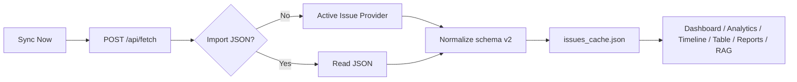

# Project Flow

## 1. Connections

使用者在 `Connections` 選擇 GitLab 或 GitHub，填入 base URL、project ref、token 與 Gemini API key，並先執行 connection test。一次只保存一個 active provider，但兩個 provider 各自保留設定與最近 project ref。

若設定 `Import JSON`，同步時會優先使用本機檔案，不呼叫 provider API。

## 2. Sync 與 Cache

同步會比較前次 `user_notes_count` 並設定 `has_new_discussions`。切換 provider、base URL 或 project ref 時會清除 Issue 與 RAG cache。

## 3. Dashboard 與 Issue Detail

Dashboard、Analytics、Timeline 與 Table 讀取 normalized cache。開啟 Issue Detail 時：

- GitLab 載入 discussions、related MR、linked issues。
- GitHub 載入 comments、related PR、dependencies、parent、sub-issues。
- UI 依 provider 顯示 MR/PR。
- GitHub relation 採 lazy-load；未載入前 `relation_counts_known=false`。
- GitHub 無 due date、milestone start date、pipeline 時顯示「GitHub 未提供」。

## 4. RAG 與 AI Chat

1. 從目前 cache 執行 RAG reindex。
2. Job 狀態與索引分別寫入 `rag_rebuild_jobs.json` 與 `rag_index.json`。
3. Chat 可使用 RAG search results 或簡化 Issue list。
4. 使用者選擇偏好模型，backend 依 candidates fallback。

## 5. Issue Arrange

1. 輸入 GitLab/GitHub 單一 Issue URL 或 repository filter URL。
2. Preview/resolve-filter 取得 Issue 清單。
3. Provider 讀取 Issue 與 comments/discussions並組合 raw text。
4. 可使用 Arrange 模型處理內容。
5. 保存 scrape/result，並可匯出 Excel。

## 6. Reports 與 Scheduler

- `POST /api/report/weekly` 產生 Markdown。
- `GET /api/report/html` 產生 HTML，由 Electron 匯出 PDF。
- Scheduler 在 App 開啟期間執行 daily sync / weekly report，使用 `meta.json.scheduler` 同日去重。
